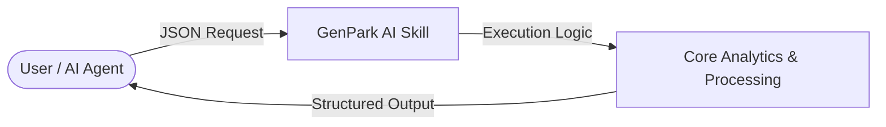

   

# genpark-agent-to-agent-brand-commerce-representative-skill

> **GenPark AI Agent Skill** -- Agent-to-Agent (A2A) brand commerce representative for LLM search recommendation

## Quick Start
```python
python example_usage.py
```

## 📊 Agentic Architecture Flowchart


## 🔌 MCP (Model Context Protocol) Integration
Run natively as an MCP server for Cursor, Claude Desktop & LLM frameworks:
```bash
python mcp_server.py
```
